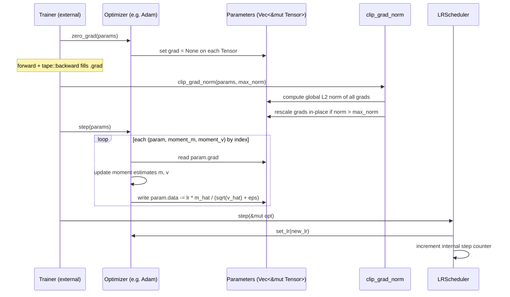
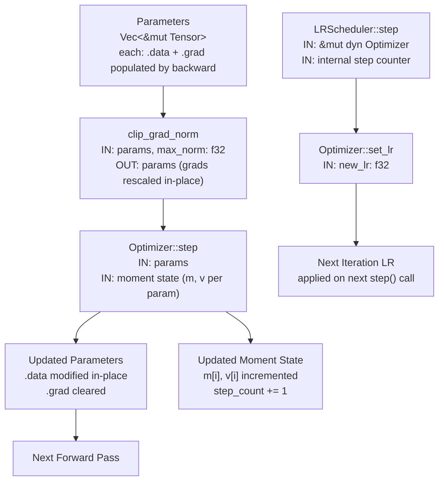

# mloptim — Architecture

## Overview

`mloptim` is a focused, composable optimizer library for Rust ML training. It provides the `Optimizer` and `LRScheduler` traits as the core abstractions, with concrete implementations of Adam, AdamW, SGD, gradient clipping utilities, and three scheduling strategies. The crate is intentionally stateless at the trait level — all mutable state (moment estimates, step counters) lives inside the concrete optimizer and scheduler structs, keeping the call signatures clean and the lifetime graph simple. `mloptim` is a leaf in the ml* dependency tree: it reads gradients from `mlautograd::Tensor` but owns no model structure.

---

## Stakeholders & Concerns

| Stakeholder | Role | Primary Concern |
|-------------|------|-----------------|
| Consumers | Training code that calls `opt.step` / `scheduler.step` | Correct parameter updates; predictable LR trajectory; no unsafe API surface |
| Maintainers | Engineers extending or bug-fixing the crate | Moment state stays consistent across steps; no hidden global mutable state |
| Contributors | Adding new optimizers or schedulers | Trait contracts are minimal and clear; internal state layout is documented |

---

## Component Diagram

```
mloptim
├── lib.rs                        (crate root — declares api/core as private, saf as public; re-exports saf::*)
│
├── api/                          [public traits; no deps on core/]
│   ├── optimizer.rs              [Optimizer trait]
│   │   └── step(&mut [&mut Tensor])
│   │   └── lr() -> f32
│   │   └── set_lr(f32)
│   └── lr_scheduler.rs           [LRScheduler trait]
│       └── step(&mut dyn Optimizer)
│       └── get_lr() -> f32
│
├── core/                         [implementations; not re-exported directly from lib.rs]
│   ├── optimizers/
│   │   ├── adam.rs       → Adam       (m, v moment vecs; bias correction)
│   │   ├── adamw.rs      → AdamW      (decoupled weight decay)
│   │   ├── sgd.rs        → SGD        (velocity vec; optional momentum)
│   │   └── grad_clip.rs  → clip_grad_norm, clip_grad_value  (free functions)
│   └── schedulers/
│       ├── step_lr.rs                 → StepLR
│       ├── cosine_annealing_lr.rs     → CosineAnnealingLR
│       └── warmup_cosine_scheduler.rs → WarmupCosineScheduler
│
└── saf/                          [sole public re-export surface]
    └── mod.rs                    (re-exports Optimizer, LRScheduler, Adam, AdamW, SGD,
                                   clip_grad_norm, clip_grad_value, StepLR,
                                   CosineAnnealingLR, WarmupCosineScheduler)
```

---

## Layer Responsibilities

| Layer | Module | Responsibility |
|-------|--------|---------------|
| `api` | `api/optimizer.rs` | Defines the `Optimizer` trait contract; all parameter updates flow through `step`; no deps on `core` |
| `api` | `api/lr_scheduler.rs` | Defines the `LRScheduler` trait contract; schedulers mutate the optimizer's LR via `set_lr`; no deps on `core` |
| `core` | `core/optimizers/adam.rs` | Stores per-parameter first and second moment vectors (`Vec<Vec<f32>>`); applies bias-corrected Adam update |
| `core` | `core/optimizers/adamw.rs` | Extends Adam with decoupled weight decay applied directly to parameters before the moment update |
| `core` | `core/optimizers/sgd.rs` | Stores per-parameter velocity vectors; applies SGD update with optional momentum scaling |
| `core` | `core/optimizers/grad_clip.rs` | Free functions that compute global gradient norms and clip in-place before the optimizer step |
| `core` | `core/schedulers/step_lr.rs` | Multiplies the current LR by gamma every N steps |
| `core` | `core/schedulers/cosine_annealing_lr.rs` | Anneals LR along a cosine curve from `lr_max` to `lr_min` over T_max steps |
| `core` | `core/schedulers/warmup_cosine_scheduler.rs` | Applies linear warmup for the first N steps then transitions to cosine decay for the remainder |
| `saf` | `saf/mod.rs` | Sole public re-export surface; assembles the crate's public API from `api` and `core` without exposing internal module paths |

---

## Data Flow

```
Training loop (external)
        │
        ▼
  opt.zero_grad(params)          ← clear gradient buffers on Tensor
        │
        ▼
  [forward pass + loss.backward] ← tape::backward fills Tensor.grad fields
        │
        ▼
  clip_grad_norm(params, max)    ← optional; rescales grads in-place
        │
        ▼
  opt.step(params)               ← reads .grad, updates .data, updates moment state
        │
        ▼
  scheduler.step(&mut opt)       ← calls opt.set_lr(new_lr) based on step count
        │
        ▼
  (next iteration)
```

---

## Sequence Diagram



## Dataflow Diagram



---

## Design Decisions

1. **`Optimizer` trait operates on `&mut [&mut Tensor]`** — no lifetime coupling to a specific model type. The caller assembles the parameter slice each step; the optimizer holds only scalar state and moment vectors.

2. **Moment state stored as `Vec<Vec<f32>>` indexed by parameter position** — allows a stateless `step` signature while keeping per-parameter state fully encapsulated. Parameter identity is positional, so the caller must pass parameters in a stable order.

3. **`clip_grad_norm` is a free function, not an `Optimizer` method** — gradient clipping is applied by the caller before `step`, not inside it. This makes the clipping decision explicit at the call site and avoids hiding policy inside the optimizer.

4. **`LRScheduler` is separate from `Optimizer`** — the two concerns are independently composable. A scheduler calls `opt.set_lr` on each step; the optimizer has no awareness of scheduling. Any scheduler works with any optimizer.

5. **`WarmupCosineScheduler` embeds warmup steps and total steps at construction** — avoids requiring a global step counter in the trainer. The scheduler is fully self-contained and produces a deterministic LR given only the number of times `step` has been called.

---

## Cross-Cutting Concerns

### Security
- No external input — optimizer operates on in-process parameter tensors only
- No global mutable state — all optimizer state (moments, step count) lives inside the concrete struct

### Error Handling
- `Optimizer::step` is infallible — parameter updates never fail; config errors (e.g. negative LR) fail at construction
- Gradient clipping (`clip_grad_norm`) is a pure in-place function; callers decide when and whether to apply it

### Performance
- Per-parameter moment state stored as `Vec<Vec<f32>>` indexed by position — sequential access is cache-friendly
- No per-step allocations — moment vectors are pre-sized at construction; `step` only reads and writes existing entries
- `LRScheduler` is a separate object — scheduling overhead is zero when no scheduler is used

## Integration Points

| System | Integration | Notes |
|--------|-------------|-------|
| `mlautograd` | Reads `Tensor.grad` and writes `Tensor.data` in `opt.step` | Gradients must be populated by `tape::backward` before `step` is called |
| `mllayers` | Calls `Layer::parameters_mut()` to collect the parameter slice passed to `step` | Layer trait is defined in `mllayers`; `mloptim` has no direct dependency on it |
| `mltraining` | `Trainer` drives the `zero_grad → backward → clip → step → scheduler.step` cycle | `mltraining` owns the training loop; `mloptim` provides the update primitives |

---

## See Also

- [Overview](../README.md)
- [Integration Guide](integration.md)
